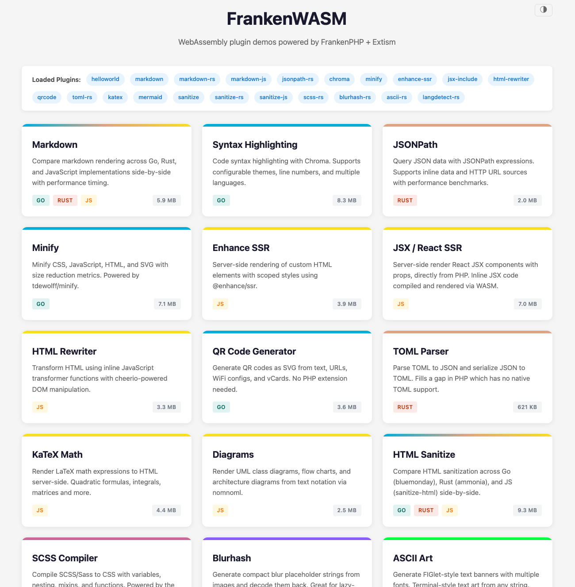

# FrankenWASM

WebAssembly plugin runtime for PHP — call Go, Rust, and JS WASM modules from PHP via [FrankenPHP](https://frankenphp.dev) + [Extism](https://extism.org).

Plugins are sandboxed, portable `.wasm` files loaded at startup that run alongside your PHP application with near-native performance.

> **Note**: This is a companion repo for my FrankenPHP conference talks. It's meant as inspiration and a reference implementation, not a production framework. Feel free to explore, fork, and adapt the patterns for your own projects.

### Talks

- [Building PHP Plugins with WebAssembly and Extism](https://phpconference.com/trends-gen-ai/php-webassembly-extism/) — PHP Conference 2025 ([slides](https://gamma.app/docs/Building-PHP-plugins-with-WebAssembly-and-Extism-PHPConference--9lt1nfffdsd8v5l))
- [PHPKonf 2025](https://phpkonf.org/) ([slides](https://gamma.app/docs/Building-PHP-plugins-with-WebAssembly-and-Extism-PHPKonf-2025-twuui0ecyow5km7))
- [Building PHP Extensions with WebAssembly](https://confoo.ca/en/2026/session/building-php-extensions-with-webassembly) — ConFoo 2026



## Plugins

20 plugins across three languages, from 256 KB to 8.3 MB:

| Plugin | Language | Size | Time | Description |
|--------|----------|------|------|-------------|
| ascii-rs | Rust | 256 KB | ~0.04 ms | FIGlet-style ASCII art banners |
| blurhash-rs | Rust | 300 KB | ~0.5 ms | Blur hash encoding/decoding |
| langdetect-rs | Rust | 529 KB | ~0.4 ms | Language detection |
| toml-rs | Rust | 621 KB | ~0.4 ms | TOML ↔ JSON conversion |
| markdown-rs | Rust | 644 KB | ~1 ms | Markdown → HTML |
| sanitize-rs | Rust | 1.2 MB | ~0.8 ms | HTML sanitization (ammonia) |
| jsonpath-rs | Rust | 2.0 MB | ~0.12 ms | JSONPath queries |
| scss-rs | Rust | 2.7 MB | ~0.2 ms | SCSS/Sass → CSS compiler |
| markdown (Go) | Go | 1.9 MB | ~2 ms | Markdown → HTML |
| qrcode | Go | 3.6 MB | ~3 ms | QR code SVG generation |
| sanitize | Go | 4.3 MB | ~22 ms | HTML sanitization (bluemonday) |
| minify | Go | 7.1 MB | ~0.2 ms | CSS/JS/HTML/SVG minification |
| chroma | Go | 8.3 MB | ~6 ms | Syntax highlighting |
| nomnoml | JS | 2.5 MB | ~21 ms | Diagram rendering (nomnoml) |
| html-rewriter | JS | 3.3 MB | ~0.8 ms | HTML transformations (cheerio) |
| markdown-js | JS | 3.4 MB | ~26 ms | Markdown → HTML (markdown-it) |
| sanitize-js | JS | 3.9 MB | ~2 ms | HTML sanitization (sanitize-html) |
| enhance-ssr | JS | 3.9 MB | ~4 ms | Custom element SSR |
| katex | JS | 4.4 MB | ~2 ms | LaTeX math rendering |
| jsx-include | JS | 7.0 MB | ~0.8 ms | React JSX server-side rendering |

Rust plugins are consistently the smallest — the entire ASCII art plugin with 5 embedded fonts compiles to just 256 KB. Go plugins include the GC and runtime, landing in the 2–8 MB range. JS plugins bundle their npm dependencies and the QuickJS runtime.

## How It Works

```
PHP  →  FrankenPHP\Wasm  →  Go host (Extism SDK)  →  .wasm plugin
```

1. **Plugins** are standalone `.wasm` files built with the Extism PDK (Go, Rust, or JS)
2. **The host** (`main.go`) discovers and loads all `.wasm` files from the `plugins/` directory
3. **PHP code** calls plugin functions through the `FrankenPHP\Wasm` class
4. **Arguments** are automatically JSON-encoded by the PHP extension and decoded by the plugin

## FrankenPHP Fork

FrankenWASM requires a [fork of FrankenPHP](https://github.com/php/frankenphp) that adds three APIs not available in upstream FrankenPHP. These are needed because the `FrankenPHP\Wasm` PHP class is implemented as a C extension that must call back into Go to reach the per-request WASM plugin registry — and upstream FrankenPHP doesn't expose the thread or extension plumbing to make that possible.

The fork adds:

| API | Language | Purpose |
|---|---|---|
| `frankenphp.Thread(index)` | Go | Retrieves a PHP thread by index, returning its `*http.Request` — which carries the request context where the WASM plugin registry is stored |
| `frankenphp.RegisterExtension(ptr)` | Go | Registers a C `zend_module_entry` as a PHP extension during `init()`, so the `FrankenPHP\Wasm` class exists in PHP |
| `frankenphp_thread_index()` | C | Returns the current thread's index from C code, so PHP extension methods can call `Thread(index)` to get back into Go |

The call chain looks like this:

```
PHP: $wasm->call('convert', $input)
  → C:  PHP_METHOD(Wasm, call)            // wasmplugin.c
  → C:  frankenphp_thread_index()         // gets current thread index
  → Go: go_wasm_call(threadIndex, ...)    // phpext.go (CGO export)
  → Go: frankenphp.Thread(threadIndex)    // retrieves the request context
  → Go: wasm.FromContext(ctx)             // gets the plugin registry
  → Go: registry.Call("convert", input)   // calls into Extism/WASM
```

The fork is referenced via a `replace` directive in `go.mod`:

```
replace github.com/dunglas/frankenphp v1.11.2 => ../frankenphp
```

## Quick Start

### Prerequisites

- Go 1.26+
- The [FrankenPHP fork](https://github.com/php/frankenphp) cloned as a sibling directory (`../frankenphp`)
- For building plugins: Go, Rust/cargo, Node.js, and [extism-js](https://github.com/extism/extism)

### Build & Run

```bash
# Build all plugins
make plugins

# Build the host binary and start the server
make run
```

The server starts on `http://localhost:8080` with the demo pages.

### Environment Variables

| Variable | Default | Description |
|---|---|---|
| `FRANKENWASM_PLUGIN_DIR` | `plugins` | Directory to scan for `.wasm` files |
| `FRANKENWASM_DOC_ROOT` | `examples` | PHP document root directory |
| `FRANKENWASM_PORT` | `8080` | HTTP listen port |
| `FRANKENWASM_THREADS` | `2` | Number of PHP threads |

## PHP API

### Static Methods

```php
use FrankenPHP\Wasm;

// List all loaded plugin names
$plugins = Wasm::list();
// => ['markdown', 'chroma', 'katex', ...]

// Get metadata (name, file size) for all plugins
$metadata = Wasm::metadata();
// => [['name' => 'markdown', 'file_size' => 1234567], ...]
```

### Instance Methods

```php
use FrankenPHP\Wasm;

// Create an instance for a specific plugin
$md = new Wasm('markdown');

// Call a function — args are auto JSON-encoded
$html = $md->call('convert', '# Hello World');

// Call with structured args
$chroma = new Wasm('chroma');
$highlighted = $chroma->call('transform', [
    'code' => '<?php echo "hi";',
    'lang' => 'php',
]);
```

### Return Values

- If the plugin returns valid JSON, it is automatically decoded to a PHP array/value
- Otherwise the raw string is returned

## Writing Plugins

Plugins use the [Extism PDK](https://extism.org/docs/category/write-a-plug-in) to read input and write output. Each exported function receives input as bytes and returns output as bytes.

See [`plugins/`](plugins/) for complete examples in all three languages, and [`examples/`](examples/) for the demo pages that exercise them.

### Go

```go
package main

import (
    "github.com/extism/go-pdk"
)

//go:wasmexport myfunction
func myfunction() int32 {
    input := pdk.Input()
    // ... process ...
    pdk.Output(result)
    return 0
}
```

Build: `GOOS=wasip1 GOARCH=wasm go build -buildmode=c-shared -tags std -o plugin.wasm`

### Rust

```rust
use extism_pdk::*;

#[plugin_fn]
pub fn myfunction(input: String) -> FnResult<String> {
    // ... process ...
    Ok(result)
}
```

Build: `cargo build --target wasm32-wasip1 --release`

### JavaScript

```javascript
function myfunction() {
    const input = Host.inputString();
    // ... process ...
    Host.outputString(result);
}

module.exports = { myfunction };
```

Build: `node esbuild.js && extism-js dist/index.js -i src/index.d.ts -o plugin.wasm`

## Project Structure

```
frankenwasm/
├── main.go              # HTTP server, plugin discovery, FrankenPHP init
├── wasm/                # Plugin manager, registry, context handling
│   ├── manager.go       # Load/instantiate plugins via Extism SDK
│   ├── registry.go      # Per-request plugin instance registry
│   ├── metadata.go      # Plugin metadata types
│   └── context.go       # Request context helpers
├── phpext/              # C + Go PHP extension (FrankenPHP\Wasm class)
│   ├── phpext.go        # Go exports called from C
│   ├── wasmplugin.c     # PHP method implementations
│   └── wasmplugin.h     # PHP method declarations
├── plugins/             # Plugin source code + built .wasm files
│   ├── markdown-go/     # Go: Markdown → HTML
│   ├── markdown-rs/     # Rust: Markdown → HTML
│   ├── markdown-js/     # JS: Markdown → HTML (markdown-it)
│   ├── chroma/          # Go: Syntax highlighting
│   ├── minify/          # Go: CSS/JS/HTML/SVG minification
│   ├── jsonpath-rs/     # Rust: JSONPath queries
│   ├── toml-rs/         # Rust: TOML ↔ JSON conversion
│   ├── sanitize/        # Go: HTML sanitization (bluemonday)
│   ├── sanitize-rs/     # Rust: HTML sanitization (ammonia)
│   ├── sanitize-js/     # JS: HTML sanitization (sanitize-html)
│   ├── enhance-ssr/     # JS: Custom element SSR (@enhance/ssr)
│   ├── jsx-include/     # JS: React JSX server-side rendering
│   ├── html-rewriter/   # JS: HTML transformations (cheerio)
│   ├── qrcode/          # Go: QR code SVG generation
│   ├── katex/           # JS: LaTeX math rendering
│   ├── nomnoml/         # JS: Diagram rendering (nomnoml)
│   ├── scss-rs/         # Rust: SCSS/Sass → CSS compiler (grass)
│   ├── blurhash-rs/     # Rust: Blur hash encoding/decoding
│   ├── ascii-rs/        # Rust: FIGlet-style ASCII art banners
│   └── langdetect-rs/   # Rust: Language detection (whatlang)
├── examples/            # PHP demo pages
└── Makefile             # Build targets
```

## License

Code is MIT — see [LICENSE.md](LICENSE.md). The [talk material](talk.md) is licensed under [CC BY 4.0](https://creativecommons.org/licenses/by/4.0/) — free to share and adapt with attribution.

## Postcardware

If you use this in a project or adapt the talk material, we'd love a postcard!

**Johan Janssens**
Ganzenbeemd 7
3294 Molenstede
Belgium
